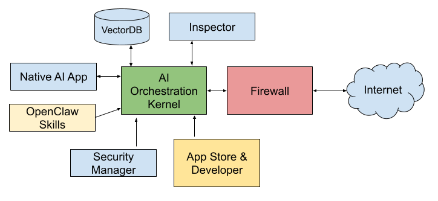

# Agent OS (AOS)

Agent OS is a simulated AI-powered Operating System running as a Node.js application. It provides a web-based "desktop" environment where users can manage files, interact with local and cloud-based Large Language Models (LLMs), dynamically install Agent Apps, and build visual agent workflows.

## Features

- **Web-Based Desktop Environment:** A fully interactive UI resembling a traditional OS desktop with windows, dragging, a taskbar, and icons.
- **AI App Store:** Browse and install simulated "Agent Apps" (such as Smart Search, AI Draw, AI Video, and system utilities) dynamically to your desktop.
- **API Key Manager:** Securely store and verify API keys for multiple providers (OpenAI, Anthropic, Google, Grok) within the OS simulated local storage.
- **Smart Search App:** A web search interface that features a real-time Execution Trace visualization panel, showing how the Kernel routes the request, decides between RAG and Web Search, and synthesizes the answer.
- **AI Flow App:** A visual, node-based graph editor (similar to ComfyUI/n8n) allowing users to chain different AI tasks. For example, piping an Ollama Chat output directly into an AI Draw node, with real-time job execution traces and inline image rendering.
- **Local Model First:** Built-in integration with Ollama to pull, manage, and chat with local models (llama3.1, etc.) without leaving the OS.
- **Agent Inspector:** A built-in security layer that intercepts the launch of any unverified external Agent App. It performs a simulated diagnostic scan (verifying memory bounds, system hooks, and network ports) to evaluate running risk before granting execution privileges, ensuring user safety.

## System Architecture



The "Kernel" of Agent OS handles complex background tasks and state management:

- **Model Router:** Intelligently evaluates prompt complexity and routes requests to the most appropriate model (e.g., Local Ollama for simple tasks, Claude 3.5 Sonnet or GPT-4o for complex tasks), with automatic fallback mechanisms.
- **Context Manager:** Manages conversation history using a hierarchical caching system (L1 memory cache, L2 summarization) and a Disk layer powered by vector databases (`vectordb`).
- **Agent Scheduler:** An asynchronous job queue that handles the execution of AI Flow graphs. It manages task dependencies, yields execution to prevent blocking, and saves JSON checkpoints to `.aos_state` to allow recovery.
- **Tool Registry:** Standardizes tools across the OS, providing an interface for apps to declare parameters and requirements for LLM function calling.
- **File System Manager:** Simulates an OS file system (`storage/system`, `storage/personal`) for reading/writing configurations, images, and user data.

### Security Model & Safety Integrations

Because Agent OS allows third-party (or LLM-generated) agents (Native AI Apps and OpenClaw Skills) to run on your simulated desktop, it employs a multi-layered security architecture around the central AI Orchestration Kernel:

1. **Security Manager:** This core component dictates overarching security policies, authorization tiers, and permissions for the kernel, ensuring robust and centralized access control.
2. **Agent Inspector (Launch Interception):** Before any app or skill is executed, the Inspector interrupts the launch to perform a deep diagnostic scan:
   - *Universal Invocation Hook:* Routes all triggers (Dock, Desktop, Search Palette) through `requestAppLaunch()`.
   - *Session Verification:* Checks `sessionStorage` to see if the agent has already been verified in the current session.
   - *Risk Evaluation Dialog:* Evaluates the app against its configured authorization tier (e.g., Tier 1 vs. Tier 3 restricted) and system hooks.
   - *Execution Gateway:* Presents a risk profile dialog. The user must explicitly click `Execute` to allow the agent to launch, safeguarding against rogue executions.
3. **System Firewall:** Acts as a strict boundary between the Orchestration Kernel and the Internet. All inbound and outbound traffic, including network requests initiated by running agents or LLMs, must pass through the firewall to prevent unauthorized data exfiltration or malicious connections.

By combining the **Security Manager**, **Inspector**, and **Firewall**, Agent OS guarantees that plugins from the App Store and custom skills operate within a tightly controlled and user-approved safe environment.


### VectorDB (Long-Term Memory)

Serving as the system's long-term memory backend, **VectorDB** provides dense vector search capabilities (powered by LanceDB) for context retrieval and semantic understanding across user sessions and system data. The `ContextManager` uses a hierarchical caching strategy:
- L1 cache holds recent interactions in memory.
- L2 cache uses LLMs to periodically summarize conversation history.
- When token thresholds are exceeded, older interactions are compressed and swapped to LanceDB (`.aos_vectors`), ensuring deep conversational history is available without overwhelming the context window of running models.

### OpenClaw Skills (Extensions)

**OpenClaw Skills** act as specialized capabilities that extend the AI Orchestration Kernel, enabling it to perform specific actions and connect to third-party services. Managed by the `SkillLoader`, these skills are dynamically loaded from `SKILL.md` files located in the `storage/skills` directory. The loader parses the metadata and instructions, injecting these explicitly into the LLM context to ensure strict adherence to required procedures and formats.

### App Store & Developer Platform

The **App Store** is a platform ecosystem that allows developers to create, publish, and distribute Native AI Apps and complex workflows. Users can dynamically install these extensions directly to their desktop environment. Because they run alongside the central Kernel, all App Store installations and third-party interactions are subject to strict oversight by the system's security and firewall protections.

## Getting Started

### Prerequisites

- **Node.js** (v18+ recommended)
- **Ollama** (optional, but highly recommended if you want to use local models)

### Installation

#### Pre-built Packages (Recommended)
You can download the latest installation packages for your operating system directly from our releases page:
[Agent OS Releases](https://github.com/CarbonSiliconAI/aios/releases)

#### Manual Installation
If you prefer to run from source:
1. Clone the repository and navigate to the project directory.
2. Install the dependencies:
   ```bash
   npm install
   ```

### Running the OS

To start the Agent OS simulation, run:

```bash
npx ts-node src/index.ts
```

Then, open your web browser and navigate to:

```text
http://localhost:3123
```

## Built With
- **Backend:** Node.js, Express, TypeScript, fs-extra
- **Frontend:** Vanilla HTML/CSS/JS, DOM-based Window Manager
- **AI Integration:** OpenAI, Anthropic, Google Generative AI, Ollama
- **Database:** LanceDB (`vectordb` package) for dense vector search

---

*Note: This is a simulation project demonstrating how an AI-native operational environment could be designed at the application layer.*
